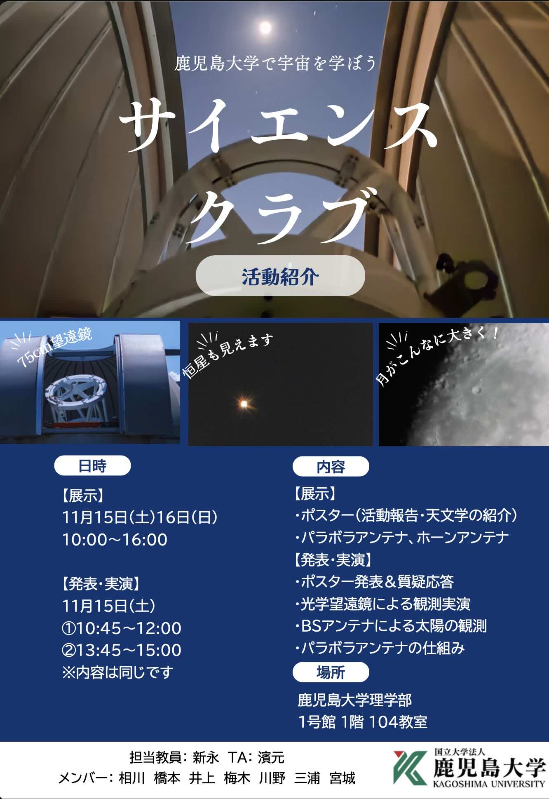

---

# Friends of Astronomy

「宇宙の美しさや不思議さを、もっと身近に。」
Friends of Astronomyは、鹿児島大学の学生が主体となって、一般の方々へ天文学の魅力を届けるためのコミュニティ活動です。

---

## 🌌 Upcoming Activities: Star Gazing Party
私たちは今後、学生が企画・運営する**「星空観望会」**を定期的に開催していく予定です。
大学の望遠鏡を使って、季節の星座や惑星、遠くの星雲、銀河を一緒に眺めてみませんか？

* **対象:** 宇宙、天文学に興味のある方ならどなたでも！
* **内容:** 学生による星空解説、75cm望遠鏡、その他望遠鏡（eVscope）での観測体験
* **詳細:** 開催日時が決まり次第、このページでお知らせします。

## 🔭 一般観望会・学生の観測活動について（サイト移行のお知らせ）

これまで本ページでご案内しておりました「一般観望会」「学生主体の望遠鏡を活用した活動」ならびに「Friends of Astronomy（天文学サポーター）」の取り組みは、学生が主体となって運営する新しい組織へと発展・移行いたしました。

観望会へのご参加や、学生の観測活動・アウトリーチへのご支援につきましては、以下の新サイトをご覧ください。

👉 **[Kagoshima University Student Observatory（鹿児島大学 Student Observatory）](https://kagoshima-univ-student-observatory.github.io/index.html)**

---

## 🖼️ Gallery & Past Events

### Open Campus Poster (November 2025)
昨年11月のオープンキャンパスで、私たちの活動を紹介するために作成したポスターです。

  
  
<em>2025年オープンキャンパスで使用したオリジナルポスター(三浦さん作)。理学部１号館屋上のドーム内から撮影。</em>

昨年のオープンキャンパス（2025年11月15日）では、高校生、家族連れを含む、多くの方々にブースへお越しいただき、宇宙の広がりについて語り合うことができました。この熱意を、今後の観望会へとつなげていきます。 

At last year's Open Campus (November 15th 2025), we were delighted to welcome many visitors, including high school students and families, to our booth, where we had inspiring discussions about the vastness of the universe. We are eager to carry this enthusiasm forward into our upcoming stargazing events

---

## 🌟 Student Members Wanted!
一緒に活動してくれる学生メンバーも募集中です。
* 天文、宇宙が好き
* 人に教えるのが好き
* イベント運営に興味がある
興味のある学生さんは、[Join the Group](join.html) ページから、または研究室までお気軽にご連絡ください！

---

---

# 寄附金のお願い Support Our Research and Activities 

鹿児島大学理学部 物理・宇宙プログラム（新永研究室）では、天文学の発展、次世代を担う若手研究者の育成、および地域社会へのアウトリーチ活動を推進するため、皆様からの温かいご支援をお願いしております。

Your generous support fuels our exploration of the universe and inspires the next generation of scientists.

🌟 How Your Contribution Makes a Difference

いただいた寄附金は、以下のような活動に大切に活用させていただきます。 

**1. 若手研究者・学生の育成支援 / Empowering Students & Early-Career Researchers**
- 学生が国内外の学会や研究会で成果発表を行うための渡航費・参加費の補助
  *Funding for students to present their research at domestic and international conferences.*
- 観測所（国立天文台など）での実習・観測に向けた派遣支援
  *Travel support for observational training and research at professional observatories (e.g., National Astronomical Observatory of Japan).*

**2. 研究環境・計算機環境の整備 / Enhancing Research & Computational Environments**
- 大規模な天文データ解析を行うためのコンピューターやストレージの導入
  *Acquisition of high-performance workstations and data storage systems for large-scale astronomical data analysis.*
- 専門的なソフトウェアや解析ツールの整備
  *Maintenance and upgrading of specialized software and analytical tools.*

**3. 最先端の天文学研究の推進 / Advancing Cutting-Edge Astronomical Research**
- 電波・光赤外線を用いた観測研究に必要な消耗品や資料の購入
  *Purchase of essential supplies, equipment, and reference materials to drive forward observational research using radio, optical, and infrared wavelengths.*

### 寄附の手続き方法　How to Donate (Tax-Deductible): 
鹿児島大学の規定により、以下の手順での受付となります。

1.  **詳細の確認 Information on Donation**
   * [👉 寄附金に関するご案内（大学公式サイトへリンク）](https://www.kagoshima-u.ac.jp/kifukin/cat1356/post-51.html) 
2.  **寄附金申込書の作成:** 以下のリンクより申込書（Microsoft Word形式）をダウンロードし、必要事項をご記入ください。 
研究室に関する必要事項（寄附目的、名称、受入先など）はあらかじめ記入済みです。  
ご記入いただく箇所 / Fields to fill in: 
寄附者情報: お名前・ご住所 Your name and address  
 item １ 寄附金額: ご希望の金額  The amount of your donation  
 item ７ 確認事項: 各項目へのチェック（○の記入）Check items only when necessary  
 Download and fill out the donation form below.    

<a href="assets/images/202203kifu_KagoshimaUniv_Shinnaga.docx" style="display: inline-block; padding: 12px 25px; background-color: #0366d6; color: white; text-decoration: none; border-radius: 6px; font-weight: bold; box-shadow: 0 2px 5px rgba(0,0,0,0.2);">📥 寄附金申込書をダウンロード / Download Form (Word)</a>

3. **書類の提出:**  ご記入いただいた書類を、下記担当窓口へ郵送またはメールにてお送りください。 
 Mail/Email to: 
 理学部 理工学研究科等事務部 理学系事務課会計係  
 Email: scikaik [at] kuas.kagoshima-u.ac.jp  
 Tel: 099-285-8020  

4.  **お振り込み:** 大学より発行される振込依頼書に基づき、金融機関にてお手続きをお願いいたします。 
   Payment (Bank Transfer Only) 
 書類の受理後、大学より「振込依頼書」が郵送されます。そちらをお持ちの上、金融機関にてお手続きをお願いいたします。 
After your application is accepted, the university will mail you a "Payment Notice (Bank Transfer Request)." Please take this document to your local financial institution to complete the payment.
If you have any questions regarding international donations, please feel free to contact us.

### お問い合わせ先 / Contact 
寄附に関するご質問や、具体的な活用方法についてのご相談は、お気軽に下記までご連絡ください。

* **Email:** shinnaga [at] sci.kagoshima-u.ac.jp ([at]を＠に置き換えてください。)
* **税制上の優遇措置:** 国立大学法人への寄附は、所得税や法人税の控除対象となります。詳細は大学の[寄附金案内ページ Donation Guidelines](https://www.kagoshima-u.ac.jp/about/zeisei.html)をご確認ください。

---

  

    "皆様の温かいご支援が、宇宙の謎を解き明かす学生たちの大きな力となります。 
    心より感謝申し上げます。"
  

  
Every gift, regardless of size, makes a difference in our journey to understand the cosmos. Thank you very much.

  
  

    ★
    ✨
    ★
    ✨
    ★
  

[👈 Back to Home](index.html)
