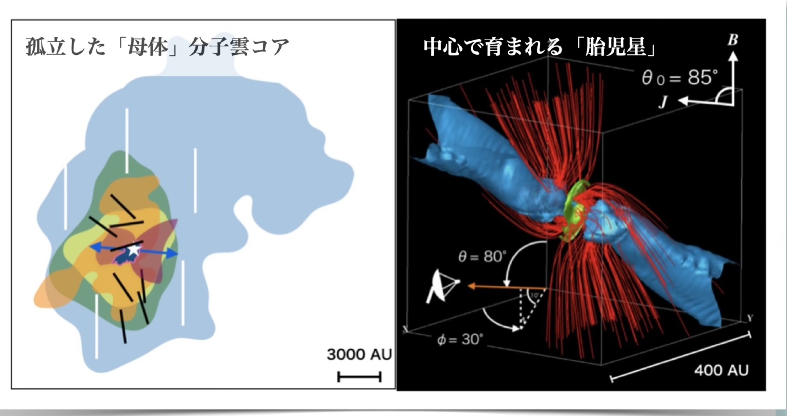
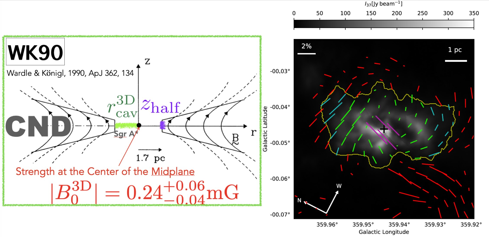

---

# Research Projects

We explore the mysteries of the Universe, focusing on star formation and evolution, the interstellar medium, and the roles of the magnetic field in our Milkyway Galaxy to understand how the magnetic field shapes our  Galaxy, mainly using world-class radio telescopes.

---

## 1. Magnetic Fields in Star Forming Regions
Stars are born in dense molecular clouds, and magnetic fields play a crucial role in their evolution. Using **astronomical polarimetry**, we visualize the "invisible" magnetic field lines.

  
  
<em>Figure 1: Visualization of magnetic field structure in a massive star-forming region.</em>

*Figure 1: Visualization of magnetic field structure in a massive star-forming region. (Fukaya, Shinnaga et al. 2023) *

* **Key Finding:** Our observations revealed that magnetic fields are surprisingly well-ordered even in turbulent environments.
* **Telescopes Used:** ALMA, JCMT (SCUBA-2/POL-2).

---

## 2. Magnetic Field in Evolved Stars and their Circumstellar Medium -- High-Resolution Observations with ALMA, VLA, VERA
The Atacama Large Millimeter/submillimeter Array (ALMA) allows us to zoom in on the very heart of stars that are just before supernova explosions.

  
  
<em>Figure 2: An image of a dying massive (25 Msun) star, VYCMa, with prominent mass loss activities traced using various  molecular Maser lines. (Shinnaga et al. 2025) </em>

---

## 3. Roles of Magnetic Field of mass accretion onto the Super Massive Black Hole (Sgr A*) at the heart of our Milkyway Galaxy
Using JCMT SCUBA-2/POL-2 submillimeter polarization technique, we measured the 3D magnetic field strengths of the Circumnuclear Disk (CND) of surrounding Sgr A* by comparing with a self-similar accregion disk model.

  
  
<em>Figure 3: Left: Magnetic field strengths measured in 3D in the Circumnuclear Disk (CND) based on a self-similar accretion disk model. Right: Measured polarization vectors towards the CND of our Milkyway Galaxy's SMBH Sgr A* (Sato, Shinnaga, Furuya et al. 2025) </em>

---

[👉 See Full Publication List](https://ui.adsabs.harvard.edu/public-libraries/QwlkFhlTTr6yhg4As8nRng)
