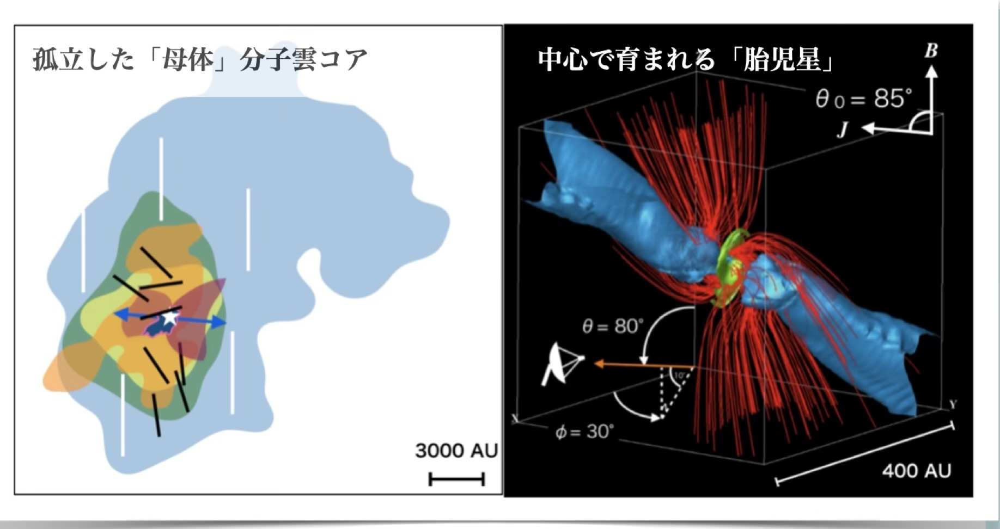
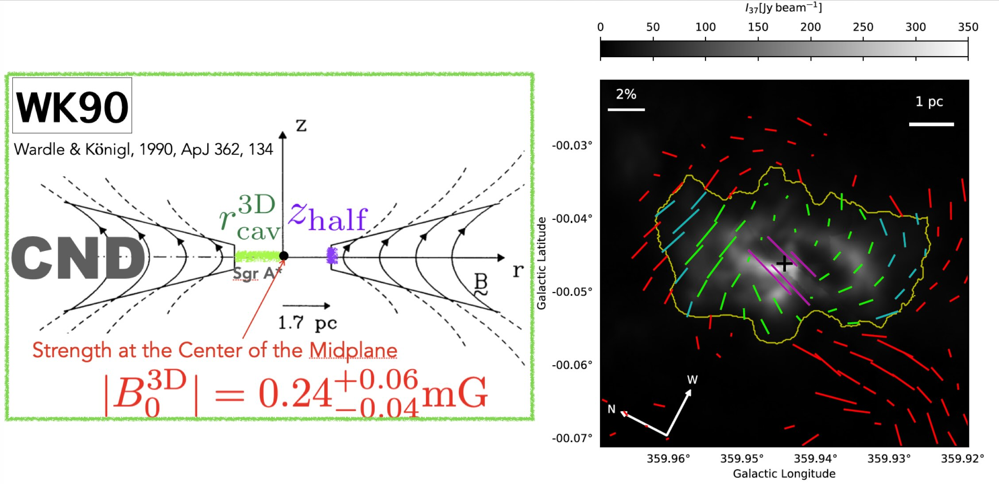

---

# Research Projects

We explore the mysteries of the Universe, focusing on star formation and evolution, the interstellar medium, and the roles of the magnetic field in our Milkyway Galaxy to understand how the magnetic field shapes our  Galaxy, mainly using world-class radio telescopes.

---

## 1. Magnetic Fields in Star Forming Regions
Stars are born in dense molecular clouds, and magnetic fields play a crucial role in their evolution. Using **astronomical polarimetry**, we visualize the "invisible" magnetic field lines.

  
  
<em>Figure 1: Visualization of magnetic field structure in a massive star-forming region.</em>

*Figure 1: Visualization of magnetic field structure in a low-mass star-forming dense core. (Fukaya, Shinnaga et al. 2023) *

* **Key Finding:** Our observations revealed that magnetic fields are surprisingly well-ordered even in turbulent environments.
* **Telescopes Used:** ALMA, JCMT (SCUBA-2/POL-2).

---

## 2. Magnetic Fields in Evolved Stars and their Circumstellar Medium -- High-Resolution Observations with ALMA, VLA, VERA
The Atacama Large Millimeter/submillimeter Array (ALMA), the Very Large Array (VLA), and the VLBI Exploration of Radio Astrometry　(VERA) allows us to zoom in on the very heart of stars that are just before supernova explosions.

  
  
<em>Figure 2: An image of a dying massive (25 Msun) star, VYCMa, with prominent mass loss activities traced using various  molecular Maser lines. (Shinnaga, Oyadomari, Imai et al. 2025) </em>

---

## 3. Roles of Magnetic Field in mass accretion onto the Super Massive Black Hole (Sgr A*) at the heart of our Milkyway Galaxy
Using JCMT SCUBA-2/POL-2 submillimeter polarization technique, we measured the 3D magnetic field strengths of the Circumnuclear Disk (CND) of surrounding Sgr A* by comparing with a self-similar accregion disk model.

  
  
<em>Figure 3: Left: Magnetic field strengths measured in 3D in the Circumnuclear Disk (CND) based on a self-similar accretion disk model. Right: Measured polarization vectors towards the CND of our Milkyway Galaxy's SMBH Sgr A* (Sato, Shinnaga, Furuya et al. 2025) </em>

また、私たちの研究グループでは、独自の望遠鏡観測に加え、大型国際観測プロジェクトのアーカイブデータも積極的に活用しています。特に、オーストラリア・コンパクトアレイ（ATCA）を用いた銀河面サーベイプロジェクト **SWAG（Survey of the Galactic Plane）** のデータを活用した研究を進めています。

*In addition to our own telescope observations, our research group actively utilizes archival data from major international observational projects. In particular, we make use of data from **SWAG (Survey of the Galactic Plane)**, a Galactic plane survey conducted with the Australia Telescope Compact Array (ATCA).*

- SWAG（ATCA Survey of the Galactic Plane）  
  [https://sites.google.com/site/atcaswag/swag-team](https://sites.google.com/site/atcaswag/swag-team)

さらに、**ALMA（アタカマ大型ミリ波サブミリ波干渉計）**、**SOFIA（成層圏赤外線天文台）**、**JCMT（ジェームズ・クラーク・マクスウェル望遠鏡）**など、国内外の主要観測施設が公開するアーカイブデータも研究に取り入れています。これらの多波長データを組み合わせることで、電波からミリ波・サブミリ波・赤外線にわたる幅広い観測データを用いた研究に取り組むことができます。

*We also incorporate archival data from other major observational facilities, including **ALMA (Atacama Large Millimeter/submillimeter Array)**, **SOFIA (Stratospheric Observatory for Infrared Astronomy)**, and **JCMT (James Clerk Maxwell Telescope)**. By combining these multi-wavelength datasets, our group is able to conduct research spanning radio, millimeter, submillimeter, and infrared observations.*

私たちの研究グループに参加する学生・研究者は、自ら望遠鏡を用いた観測を行うだけでなく、こうした国際的なアーカイブデータを解析する研究にも携わることができます。

*Students and researchers who join our group have the opportunity not only to conduct their own telescope observations, but also to work with these international archival datasets.*

---

[👉 See Full Publication List](https://ui.adsabs.harvard.edu/public-libraries/QwlkFhlTTr6yhg4As8nRng)
